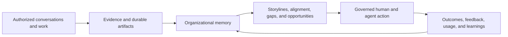

# STRIDE

> A company operating system that remembers, understands, and acts with receipts.

[](LICENSE)


Built by **That's Cool**, an independent lab for ambitious ways of working.

**STRIDE** is the product and the emerging open operating platform for human-and-agent work. **BonfireOS** is its first implementation and proving ground.

At STRIDE's core is an idea called **AmbientMind**: a permissioned organizational intelligence layer that can remember what happened, understand what is changing, help the company act, and explain its work with evidence. AmbientMind is part of STRIDE—not a second product or identity.

Meetings are an important sensor. They are not the product.

The product spans private Scout conversations, shared threads, live rooms, agent runs, artifacts, decisions, board state, feedback, and model usage. It turns those authorized signals into durable organizational memory—then uses that memory to surface storylines, alignment, gaps, opportunities, ownership, and governed next actions.

[Explore the STRIDE vision](https://workinstride.xyz) · [Read the active 2.0 execution ledger](docs/plans/bonfireos-2.0-execution.md) · [Read the W2 design](docs/plans/bonfireos-w2-design.md)

## The AmbientMind inside STRIDE

Most companies have the raw material for collective intelligence but no trustworthy system that can assemble it. Context gets scattered across calls, chats, documents, agent sessions, dashboards, and individual memory. Activity is visible; understanding is not.

STRIDE closes that loop:



It should let a teammate or executive ask:

- What changed this week, and what evidence supports that?
- Where are teams aligned—and where are they talking past each other?
- Which storylines are moving, stalled, contradicted, or quietly dying?
- Who is doing what, what did our agents produce, and did anyone use it?
- Which decisions are current, and which were superseded?
- Where are tokens and model spend going, and what value came back?
- What should we do next—and what requires a human decision?

The answer is not an omniscient chatbot. It is a permissioned view assembled from sources the requester is allowed to see, with coverage and provenance attached.

## One system, many surfaces

| Surface | Role in the AmbientMind |
|---|---|
| **Scout** | A private, owner-scoped thinking space and voice interface. It can answer, propose work, or launch governed agent workflows. |
| **Chat** | Shared channels, threads, agent progress, approvals, and durable deliverables. |
| **Rooms** | Multi-participant WebRTC spaces with video, audio, screen share, transcription, consent controls, and room-aware Scout. |
| **Intelligence** | Themes, alignments, open questions, decisions, contribution signals, and living company storylines. |
| **Board** | Visible operating state that conversations and authorized agents can update through the same audited tool path. |
| **Memory** | Search and recall across authorized transcripts, decisions, artifacts, narratives, and company context. |
| **Artifacts** | Versioned outputs from people and agents, with provenance, review, feedback, sharing, and approval controls. |
| **Usage** | Per-model and per-seat token flow, cost, failures, accepted output, and quality telemetry. |
| **iOS (Expo)** | Native shell under [`mobile/`](mobile/) — same session auth, rooms, Scout, and board APIs as the web; full OS via authenticated WebView. EAS project `@axx_archive/bonfireos`. |

These are not separate mini-products. They are views into one loop: **conversation → evidence → understanding → governed action → learning**.

## What gets remembered

BonfireOS preserves more than transcripts.

- Private Scout history remains owner-scoped. Private content is not silently promoted into organization-wide recall.
- Shared conversations and consented room activity can produce source-linked memory, decisions, narratives, and follow-up work.
- Direct requests and accepted suggestions can launch restartable agent workflows.
- Agent runs create durable, versioned artifacts rather than disappearing into a chat response.
- Opens, edits, feedback, approvals, rejections, and outcomes become learning signals for future process improvement.
- Every metered model seat writes usage and quality telemetry so cost and output health can be inspected together.

Authorization travels with the source. Retrieved content is data, never tool authority. Guests cannot authorize tools. Consequential external actions remain human-gated.

## What is real today

This repository grew from OpenAI's realtime meeting-assistant example, but the current system is substantially broader. The first implementation includes:

- account authentication, sessions, passkeys, password reset, guest links, and room-scoped access;
- a custom Pion WebRTC media stack with audio/video, screen share, TURN support, recovery, and participant limits;
- shared room Scout plus private Scout chat and voice;
- a dedicated transcription lane, speaker-attributed meeting memory, digests, semantic and lexical recall;
- durable decision records, themes and alignments, living storyline dossiers, and mission-intelligence views;
- Kanban tools used by both live Scout and background workers;
- restartable `/goal` workflows with decomposition, dependencies, agent execution, review, gates, artifacts, reporting, and verification;
- research, design, image, deck, packaging, and Codex-backed work threads;
- versioned artifacts with content-addressed assets, provenance, approvals, sharing, export, and feedback signals;
- an append-only usage ledger and rollup API covering model seat, token flow, cost, latency, errors, and accepted output;
- canonical event, ACL, consent, retention, approval, outbox, and PostgreSQL shadow contracts from W1.

This is a strong working 1.0, not a claim of finished autonomy. The [2.0 execution ledger](docs/plans/bonfireos-2.0-execution.md) is the source of truth for release status.

## What 2.0 is proving

The active W2 work deliberately narrows the next release to trust and product truth:

1. **Room isolation and exact recap** — independent room-owned Scout runtimes, durable first-admission anchors, explicit consent lanes, and evidence-linked catch-up without cross-room leakage.
2. **A restart-safe company brain** — deterministic projections, complete authorized historical inventory, honest coverage, temporal queries, and claim-to-primary-evidence resolution.
3. **Insights & Opportunities v1** — one closed, evidence-bound workflow that produces decision-ready reports, survives critic/revision gates, accepts typed human feedback, and earns ten reviewed pilot records.
4. **Evaluation before routing** — product, recall, transcription, workflow, and model-route corpora must pass before dynamic route canaries or a broader platform claim.

Not yet proven: managed HA/object storage, the full JSON/JSONL-to-PostgreSQL cutover, a portable STRIDE conformance suite, or a production-ready ecosystem of third-party implementations.

## Trust model

The AmbientMind must earn the right to be ambient.

- **Private means private.** Private Scout threads are owner-scoped; derived outputs cannot widen source visibility.
- **Consent is a capability.** Audio capture, transcription, model analysis, and organization memory are separate lanes that fail closed.
- **Evidence outranks fluency.** Asserted claims must resolve to authorized source revisions; missing or stale coverage is visible.
- **Memory is correctable.** Retention, revocation, purge, supersession, and revision history are part of the data model.
- **Agents have bounded authority.** Tool access depends on the authenticated principal and current revision—not on words found in retrieved content.
- **Writes have gates.** Commit, push, deploy, email, sharing, and other consequential actions require revision-bound approval.
- **Video survives AI failure.** Media and admission continue when model providers degrade; stale or partial AI output is labeled.
- **Cost is part of truth.** Wire usage, accepted output, failures, latency, and estimated cost are recorded per model seat.

The deeper contracts live in [canonical events and ACLs](docs/plans/canonical-event-acl-v1.md), [multi-room design](docs/plans/multi-room-2026-07-08.md), and the [W2 decision-complete design](docs/plans/bonfireos-w2-design.md).

## Architecture

BonfireOS is intentionally a modular Go control plane, not a microservice fleet.

```text
Browser shell
  ├── authenticated chat, intelligence, board, memory, and artifacts
  └── WebRTC media + WebSocket event stream
             │
Go application
  ├── room/media runtime (Pion)
  ├── Scout, memory, intelligence, decisions, and narratives
  ├── workflow engine, artifacts, approval lanes, and signals
  ├── canonical capture, ACLs, consent, retention, and outbox
  └── usage/evaluation ledger
             │
Durable state
  ├── JSON/JSONL authoritative readers + content-addressed blobs
  ├── PostgreSQL canonical shadow and projections
  └── isolated Codex queue and usage volumes
             │
Replaceable model/agent seats
  ├── realtime voice and transcription
  ├── extraction, recall, intelligence, and review
  └── sidecar agent execution with evidence callbacks
```

Current production-style deployment uses Docker Compose on a VPS. Repository `data/` is seed/development data, never production truth.

## Run locally

### Requirements

- Go 1.24 or newer
- Opus and `pkg-config`
- An OpenAI API key for Realtime, transcription, and OpenAI-backed model seats
- Optional Anthropic and Codex configuration for alternate agent seats

On macOS:

```bash
brew install opus pkg-config
export OPENAI_API_KEY=<your_api_key>
go run .
```

Open [http://localhost:3000](http://localhost:3000). The server reads environment variables directly; it does not load `.env` automatically.

Without a working AI provider, the browser and media room still load, but AI-backed voice, transcription, recall, and workflow capabilities report degraded or remain unavailable.

### Core configuration

| Variable | Purpose |
|---|---|
| `OPENAI_API_KEY` | Realtime, transcription, embeddings, image, and OpenAI text seats |
| `OPENAI_REALTIME_MODEL` | Shared-room Realtime model; defaults to the model configured in code |
| `OPENAI_TRANSCRIPT_MODEL` | Dedicated transcript-lane override |
| `OPENAI_BRAIN_MODEL` | Ambient extraction and company-memory model |
| `ANTHROPIC_API_KEY` | Enables Anthropic-backed orchestration and review seats |
| `BONFIRE_AGENT_THREAD_WORKER` | Selects structured text output or sidecar Codex execution |
| `BONFIRE_CODEX_RUNNER_MODE` | Sidecar queue or local development execution |
| `MEETING_ROOM_MAX_PARTICIPANTS` | Room capacity; defaults to 10 |
| `MEETING_ALLOWED_ORIGINS` | Allowed browser origins for WebSocket access |
| `MEETING_STUN_URLS` / `MEETING_TURN_URLS` | ICE connectivity for restrictive networks |
| `MEETING_BRAIN_DISABLED` | Disables the background brain worker |
| `MEETING_DIGEST_DISABLED` | Disables meeting digest generation |
| `USAGE_LEDGER_DISABLED` | Disables usage and evaluation recording |
| `BONFIRE_PUBLIC_URL` | Canonical production URL for secure links |

Additional model-seat and runner controls are documented alongside their implementations in `usage_ledger.go`, `codex_runner.go`, `agent_runner_anthropic.go`, and `kanban.go`. Operational activation guidance lives in [docs/ops3-fable-activation.md](docs/ops3-fable-activation.md).

## Development and verification

```bash
go test ./...
go test -race ./...
```

The repository contains focused contract tests for privacy, guest access, cross-room boundaries, artifacts, approvals, canonical capture, recall, usage, agent workflows, and media behavior. Green local tests are necessary evidence, but the 2.0 ledger also requires restart, replay, soak, provider-degradation, and live isolation gates.

## Project direction

The naming hierarchy is:

- **STRIDE** — the product and eventual open platform.
- **AmbientMind** — a core STRIDE concept: its permissioned, evidence-bearing organizational intelligence layer.
- **BonfireOS** — the first implementation and proving ground.
- **That's Cool** — the independent lab building it.

The repository will earn that abstraction from working contracts and conformance evidence—not from a rename alone. Until then, the code and active 2.0 ledger remain the most honest description of what exists.

## License

This project is licensed under the [MIT License](LICENSE).
